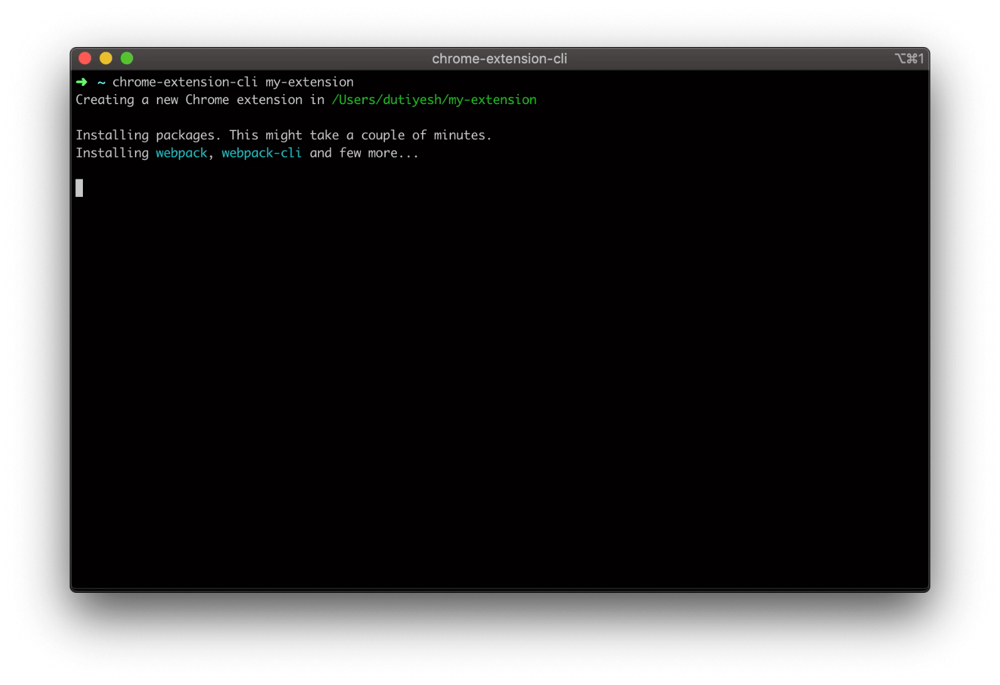
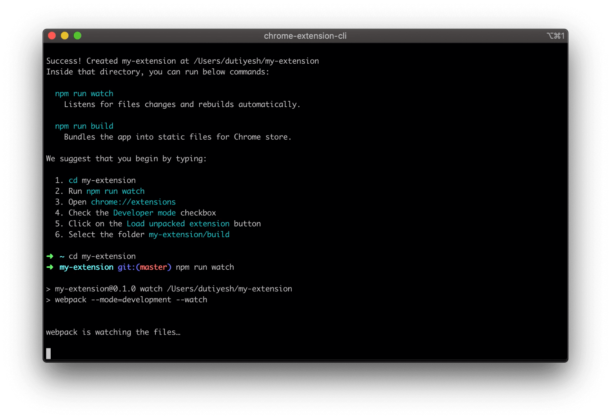
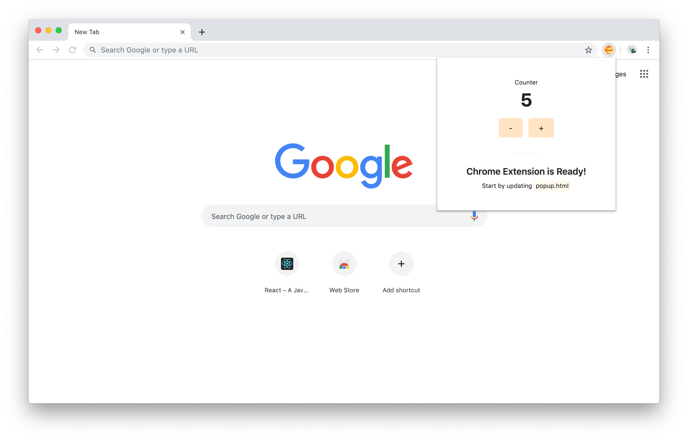
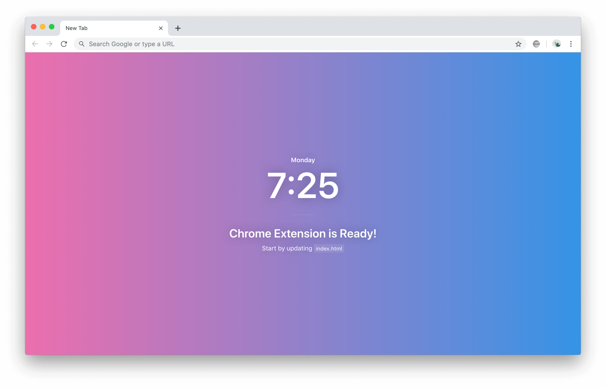
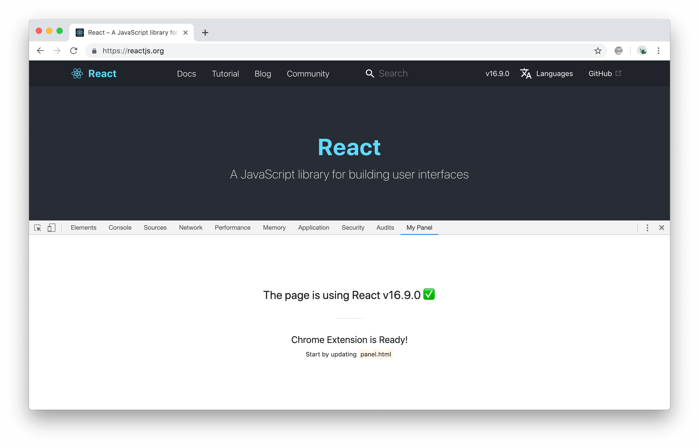
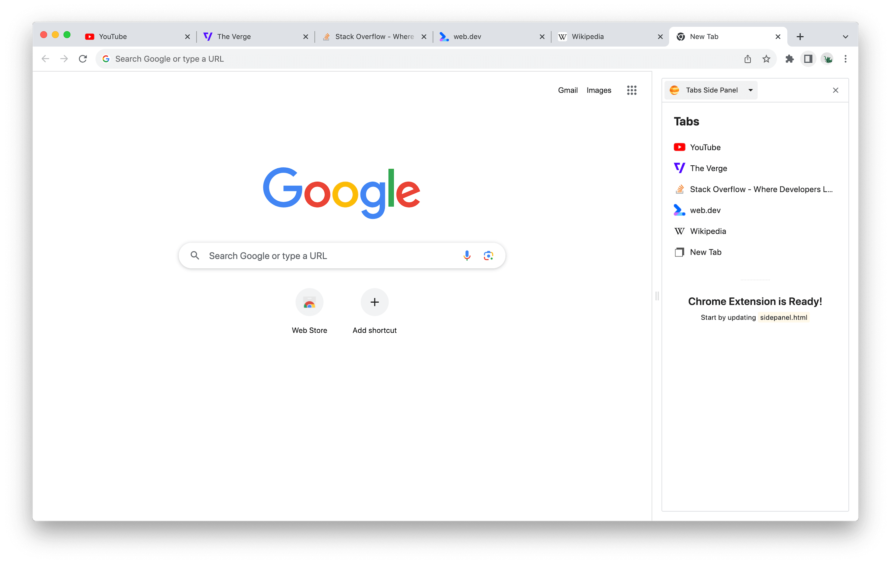

# Chrome Extension CLI

The CLI for your next Chrome Extension. 🚀

<p>
  <a href="https://www.producthunt.com/posts/chrome-extension-cli?utm_source=badge-featured&utm_medium=badge&utm_souce=badge-chrome-extension-cli" target="_blank">
    
  </a>

  <a href="https://www.producthunt.com/posts/chrome-extension-cli?utm_source=badge-top-post-badge&utm_medium=badge&utm_souce=badge-chrome-extension-cli" target="_blank">
    
  </a>
</p>

## Quick Overview

```sh
npm install -g chrome-extension-cli
chrome-extension-cli my-extension
cd my-extension
npm run watch
```

Then follow these instructions to see your extension:
1. Open **chrome://extensions**
2. Check the **Developer mode** checkbox
3. Click on the **Load unpacked extension** button
4. Select the folder **my-extension/build**

When you're ready to publish to Chrome Web Store, create a minified bundle with `npm run build` and zip it with `npm run pack`.
Or you can zip the `build` folder manually.

<div align="center">
  
  
</div>

### Get Started Immediately

You **don’t** need to install or configure Webpack.<br>
Webpack comes in preconfigured, so that you can focus on the code.

Just create a project, and you’re good to go.

## Creating an Extension

### Installation

```sh
npm install -g chrome-extension-cli
```

### Usage

```sh
chrome-extension-cli <project-name>
```

Example:
```sh
chrome-extension-cli my-extension
```

It will create a directory called `my-extension` inside the current folder.<br>
Inside that directory, it will generate the initial project structure and install the transitive dependencies:

```
my-extension
├── README.md
├── node_modules
├── package.json
├── .gitignore
├── config                    // Webpack with minimal configurations
│   ├── paths.js
│   ├── webpack.common.js
│   └── webpack.config.js
├── public
│   ├── icons
│   │   ├── icon_16.png
│   │   ├── icon_32.png
│   │   ├── icon_48.png
│   │   ├── icon_128.png
│   ├── *.html                // HTML files will vary depending on extension type
│   └── manifest.json
└── src
    ├── *.css                 // CSS files will vary depending on extension type
    └── *.js                  // JS files will vary depending on extension type
```

Once the installation is done, you can open your project folder:

```sh
cd my-extension
```

Inside the newly created project, you can run some built-in commands:

### `npm run watch`

Runs the app in development mode.<br>
Then follow these instructions to see your app:
1. Open **chrome://extensions**
2. Check the **Developer mode** checkbox
3. Click on the **Load unpacked extension** button
4. Select the folder **my-extension/build**

### `npm run build`

Builds the app for production to the build folder.<br>
Run `npm run pack` to
zip the build folder and your app is ready to be published on Chrome Web Store.<br>
Or you can zip it manually.

### `npm run pack`

Packs the build folder into a zip file under release folder.

### `npm run repack`

Rebuilds and packs the app into a zip file.
It is a shorthand for `npm run build && npm run pack`.

### `npm run format`

Formats all the HTML, CSS, JavaScript, TypeScript and JSON files.

## What's included?

Your environment will have everything you need to build a Chrome Extension:

- ES6 syntax support.
- A watch script to listen file changes and build automatically.
- A build script to bundle JS, CSS, and images for production.

## Extension types

With Chrome Extension CLI you can built any of the below extensions:

### Popup

Add features to Active Tab.

<div align="center">
  <figure>
    
  </figure>
</div>


### Override page

Override default page like New Tab, Bookmarks, or History page.

<div align="center">
  <figure>
    
  </figure>
</div>


### DevTools

Add features to Chrome Developer Tools.

<div align="center">
  <figure>
    
  </figure>
</div>


### Side Panel

Add features to Chrome Side Panel.

<div align="center">
  <figure>
    
  </figure>
</div>

More information about [templates](templates/README.md).

## CLI options

#### `chrome-extension-cli my-extension --override-page`

Creates an extension that overrides default New Tab page.<br>
You can also pass other values to `--override-page` option to override other default pages like Bookmarks and History page.

```
chrome-extension-cli my-extension --override-page              // Override New Tab page
chrome-extension-cli my-extension --override-page=bookmarks    // Override Bookmarks page
chrome-extension-cli my-extension --override-page=history      // Override History page
```

#### `chrome-extension-cli my-extension --devtools`

Creates a Panel inside developer tools.

#### `chrome-extension-cli my-extension --side-panel`

Creates a Panel in the browser's side panel alongside the main content of a webpage.

#### `chrome-extension-cli my-extension --language`

Creates an extension for supported languages like JavaScript and TypeScript.<br>
By default extension is created for JavaScript language and you can also pass other value to `--language` option to create extension for TypeScript.

```
chrome-extension-cli my-extension                          // Language JavaScript (default)
chrome-extension-cli my-extension --language=javascript    // Language JavaScript
chrome-extension-cli my-extension --language=typescript    // Language TypeScript
```

## Contributing

See the [contribution guide](CONTRIBUTING.md) and join the contributors!

## FAQs

See the [FAQs](FAQ.md).

## License

Chrome Extension CLI is open source software [licensed as MIT](LICENSE).

---

_Many thanks to [create-react-app](https://github.com/facebook/create-react-app/blob/master/README.md) for the inspiration with this readme file._

_Jupiter Icon used in templates made by [Freepik](https://www.freepik.com/home) from [www.flaticon.com](http://www.flaticon.com/)._
